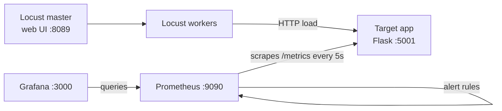

# qa-py-locust-grafana

Distributed load testing with Locust against a sample Flask API, with Prometheus scraping the app's metrics and Grafana dashboards provisioned automatically, all in one Docker Compose stack.

[](https://github.com/yashwant-das/qa-py-locust-grafana/actions/workflows/load-test.yml)
[](https://github.com/yashwant-das/qa-py-locust-grafana/actions/workflows/load-test.yml)
[](LICENSE)
[](https://locust.io)
[](https://prometheus.io)
[](https://grafana.com)

## Why it exists

A load test result is only useful next to what the system was doing at the time. This repo runs Locust in master and worker mode against a target app that exposes Prometheus metrics, so request rate, errors and response times from the app side sit on a Grafana dashboard while the load runs. It is a starting point for a performance test stack, with three scenarios: steady load, error injection and a spike shape.

## Architecture



Locust workers send load to the Flask target app; Prometheus scrapes the app's `/metrics` endpoint, and Grafana reads from Prometheus through auto-provisioned datasources and dashboards.

## Quickstart

Prerequisites: Docker with Compose v2, about 4 GB of memory for the containers, and free ports 3000, 5001, 8089 and 9090.

```bash
git clone https://github.com/yashwant-das/qa-py-locust-grafana.git && cd qa-py-locust-grafana
docker compose up --build -d
```

Then open:

| Service | URL | Notes |
| --- | --- | --- |
| Locust web UI | <http://localhost:8089> | Set users and spawn rate, then start swarming. Host is preset to `http://target-app:5000`. |
| Grafana | <http://localhost:3000> | Login `admin` / `admin` (local default, set in `docker-compose.yml`) |
| Prometheus | <http://localhost:9090> | Targets, queries and alerts |
| Target app | <http://localhost:5001> | `/health`, `/metrics` and the `/users` API |

Add workers with `docker compose up -d --scale locust-worker=4`. Stop everything with `docker compose down` (add `-v` to delete the Prometheus and Grafana volumes).

### Other scenarios

The stack starts with `simple_load.py`. The scenarios directory is mounted at `/mnt/locust` in the Locust containers, so a different scenario runs headless like this:

```bash
docker compose exec locust-master locust -f /mnt/locust/spike_load.py \
  --headless --host http://target-app:5000 --html /tmp/spike_report.html
```

| Scenario | File | What it does |
| --- | --- | --- |
| Steady load | `simple_load.py` | Reads and creates users, weighted toward `GET /users` |
| Error injection | `error_simulation.py` | Mixes valid calls with invalid IDs and invalid payloads, and marks the expected failures |
| Spike | `spike_load.py` | Load shape over 10 minutes: ramp to 50 users, spike to 200, drop to 10, and repeat |

## Test reports and results

- CI validates `docker-compose.yml`, starts the target app and runs a 60-second headless `simple_load.py` test with 20 users on every push and pull request. The Locust HTML report and CSV stats are attached to each run as the `locust-report` artifact: open the [latest Load test run](https://github.com/yashwant-das/qa-py-locust-grafana/actions/workflows/load-test.yml) and download it.
- Locally, add `--html <file>` to any headless run for the same report, or watch live results in the Locust web UI and Grafana.

### Dashboards and alerts

| Dashboard | Shows |
| --- | --- |
| Performance Metrics | Target app request rate, success and error rates, average response time, active connections |
| Infrastructure | Prometheus health, scrape targets and storage |
| Locust | Locust users, request rate and response time percentiles (see known gaps) |

Alert rules live in `grafana/prometheus/alert_rules.yml`: service down, high error rate and high response time.

### Known gaps

- Nothing exports Locust's own metrics to Prometheus yet, so the Locust dashboard stays empty; use the Locust web UI or HTML report for Locust-side numbers.
- The high error rate and high response time alerts query `http_requests_total` and `http_request_duration_seconds_bucket`, which the target app does not export. It exposes `app_*` counters and an average response time gauge, so only the service-down alert can fire today.
- `validate_framework.py` calls the Compose v1 `docker-compose` command.

## Tech stack

| Layer | Tool | Version | Why |
| --- | --- | --- | --- |
| Load generation | Locust, master and workers | 2.x (unpinned) | Python scenarios and distributed load |
| Target app | Flask | unpinned | Small API with a hand-written Prometheus endpoint |
| Metrics | Prometheus | `latest` image | Scrapes the app every 5 seconds, evaluates alert rules |
| Dashboards | Grafana | `latest` image | Provisioned datasource and three dashboards |
| Orchestration | Docker Compose, GitHub Actions | v2 | One command locally, smoke load test in CI |

## Project structure

```text
├── locustfiles/scenarios/   # simple_load.py, error_simulation.py, spike_load.py
├── target-app/              # Flask API with /health and /metrics
├── grafana/
│   ├── dashboards/          # Dashboard JSON
│   ├── provisioning/        # Datasource and dashboard provisioning
│   └── prometheus/          # prometheus.yml and alert_rules.yml
├── validate_framework.py    # Checks containers, endpoints, targets and datasources
├── docker-compose.yml
└── Dockerfile               # Locust image
```

## License

MIT. See [LICENSE](LICENSE).
