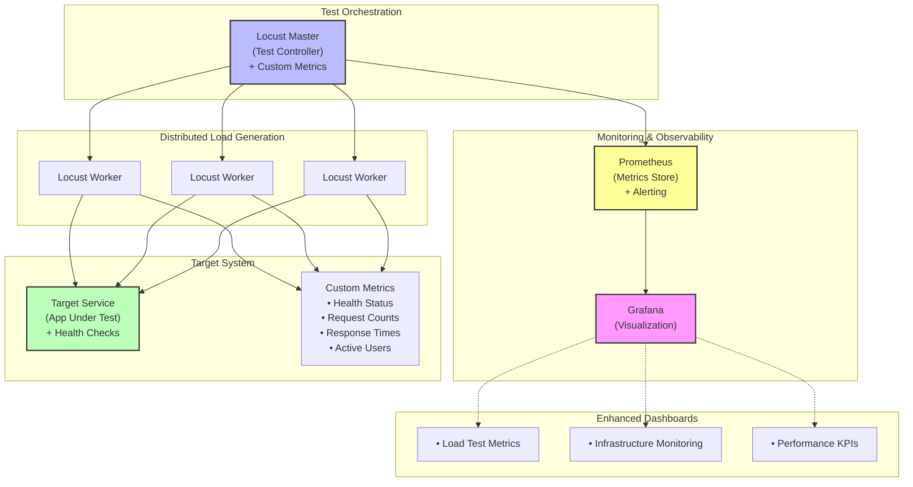

# Enterprise Performance Testing Framework

A comprehensive, enterprise-grade performance and load testing framework designed for modern web applications and APIs. This framework provides a complete observability stack with advanced monitoring, custom metrics, and production-ready configurations.

## Overview

This framework delivers a scalable, containerized solution for performance testing with deep insights into application behavior under load. Built with industry-standard tools and enhanced with custom metrics, alerting, and comprehensive dashboards for enterprise environments.

## Key Features

- **Advanced Load Testing**: Multiple test scenarios including spike loads, stress testing, and error simulation
- **Custom Metrics**: Application-specific metrics with Prometheus integration
- **Enhanced Dashboards**: Multiple Grafana dashboards for different stakeholder needs
- **Intelligent Alerting**: Prometheus alerting rules for error rates and response times
- **Health Monitoring**: Comprehensive health checks and service dependency management
- **Production Ready**: Docker Compose orchestration with proper networking and scaling
- **Environment Configuration**: Flexible configuration through environment variables
- **Automated Validation**: Built-in validation scripts for deployment verification

## Architecture



## Core Components

### Load Testing Engine
-   **Locust Master:** Test orchestration with advanced web UI and real-time statistics
-   **Locust Workers:** Distributed load generation with auto-scaling capabilities
-   **Custom Test Scenarios:** Pre-built scenarios for various testing patterns

### Monitoring & Observability
-   **Prometheus:** Time-series metrics collection with custom scraping configurations
-   **Grafana:** Multi-dashboard visualization platform with auto-provisioned datasources
-   **Custom Metrics:** Application-specific metrics in Prometheus format
-   **Alerting Rules:** Automated alerts for error rates, response times, and system health

### Target Application
-   **Enhanced Flask API:** Sample application with comprehensive metrics endpoint
-   **Health Monitoring:** Built-in health checks and status reporting
-   **Request Tracking:** Detailed request/response metrics and logging

## Getting Started

### Prerequisites

- Docker and Docker Compose installed on your system
- At least 4GB of RAM available for containers
- Ports 3000, 5001, 8089, and 9090 available on your host system
- Python 3.9+ (for local validation scripts)

### Quick Start

1. **Clone and Navigate:**
   ```bash
   git clone <repository-url>
   cd performance-testing-framework
   ```

2. **Launch the Framework:**
   ```bash
   docker-compose up --build -d
   ```
   
   This command will:
   - Build the necessary Docker images
   - Start all services with health checks
   - Configure service dependencies
   - Auto-provision Grafana dashboards

3. **Validate Deployment:**
   ```bash
   python3 validate_framework.py
   ```
   
   This script provides comprehensive validation including:
   - Docker container health status
   - Service endpoint accessibility
   - Prometheus target verification
   - Custom metrics collection status
   - Grafana datasource configuration

### Environment Configuration

The framework supports flexible configuration through environment variables. Copy the template and customize:

```bash
# Copy the environment template
cp .env.example .env

# Edit configuration values
nano .env
```

Example configuration:
```bash
# Load Test Configuration
LOCUST_USERS=20
LOCUST_SPAWN_RATE=5
LOCUST_RUN_TIME=300

# Security Configuration  
GF_SECURITY_ADMIN_PASSWORD=your_secure_password
PROMETHEUS_RETENTION_TIME=15d

# Monitoring Configuration
METRICS_SCRAPE_INTERVAL=5s
HEALTH_CHECK_INTERVAL=10s
```

### Service Access Points

Once services are running, access the components:

- **Locust Web UI:** [http://localhost:8089](http://localhost:8089) - Load test control and real-time stats
- **Grafana Dashboards:** [http://localhost:3000](http://localhost:3000) - Multi-dashboard monitoring (admin/admin)
- **Prometheus UI:** [http://localhost:9090](http://localhost:9090) - Metrics exploration and alerting
- **Target API:** [http://localhost:5001](http://localhost:5001) - Application under test with health/metrics endpoints

## Advanced Features

### Multiple Test Scenarios

The framework includes sophisticated pre-built test scenarios:

1. **Simple Load Test** (`simple_load.py`): 
   - Steady-state load testing with realistic user behavior patterns
   - Validates basic application functionality under normal load conditions

2. **Error Simulation** (`error_simulation.py`): 
   - Tests application resilience by intentionally triggering error conditions
   - Validates error handling, recovery mechanisms, and system stability

3. **Spike Load Test** (`spike_load.py`): 
   - Multi-stage load progression from baseline to peak traffic with sudden spikes
   - Tests auto-scaling capabilities and performance under traffic bursts

4. **Custom Load Shapes**: 
   - Configurable load patterns for specialized testing scenarios
   - Support for custom user behavior modeling and traffic simulation

#### Running Specific Scenarios

To execute different test scenarios, modify the docker-compose.yml or run directly:

```bash
# Run spike load test
docker-compose exec locust-master locust -f /mnt/locust/scenarios/spike_load.py \
  --master-bind-host=0.0.0.0 --host=http://target-app:5000 \
  --users=50 --spawn-rate=5 --run-time=10m --html=spike_report.html

# Run error simulation
docker-compose exec locust-master locust -f /mnt/locust/scenarios/error_simulation.py \
  --master-bind-host=0.0.0.0 --host=http://target-app:5000
```

### Enhanced Monitoring & Dashboards

#### Multi-Dashboard Architecture

1. **Locust Performance Dashboard**:
   - Real-time request rates and throughput metrics
   - Response time percentiles (50th, 95th, 99th)
   - Error rate monitoring with configurable thresholds
   - Active user count and spawn rate tracking

2. **Infrastructure Monitoring Dashboard**:
   - System resource utilization (CPU, Memory, Network)
   - Container health and status monitoring
   - Service dependency tracking
   - Alert status and firing alerts overview

3. **Performance Metrics Dashboard**:
   - Application-specific KPIs and business metrics
   - Custom metric visualization and analysis
   - Historical performance trend analysis
   - SLA compliance monitoring

#### Custom Metrics Collection

The framework collects comprehensive custom metrics:

```prometheus
# Application Health
app_health_status{instance="target-app:5000"} 1

# Request Metrics
app_requests_total{instance="target-app:5000"} 1234
app_requests_success_total{instance="target-app:5000"} 1200
app_requests_error_total{instance="target-app:5000"} 34

# Performance Metrics
app_response_time_avg{instance="target-app:5000"} 0.045
app_active_connections{instance="target-app:5000"} 25
app_users_count{instance="target-app:5000"} 150
```

### Intelligent Alerting

#### Prometheus Alert Rules

Pre-configured alerting rules for common performance issues:

- **High Error Rate**: Triggers when error rate exceeds 5% over 2 minutes
- **High Response Time**: Alerts when 95th percentile exceeds 500ms
- **Service Down**: Immediate notification when services become unavailable
- **Resource Exhaustion**: Alerts for high CPU/memory usage

#### Custom Alert Configuration

Add custom alerts by modifying `grafana/prometheus/alert_rules.yml`:

```yaml
groups:
  - name: custom_performance_alerts
    rules:
      - alert: CustomMetricThreshold
        expr: app_custom_metric > 100
        for: 1m
        labels:
          severity: warning
        annotations:
          summary: "Custom metric threshold exceeded"
```

### Health Checks & Reliability

#### Service Health Monitoring

All services include comprehensive health checks:

- **Target App**: `/health` endpoint with detailed status information
- **Locust Master**: Web UI availability and worker connectivity
- **Prometheus**: Metrics collection and target health verification  
- **Grafana**: Dashboard accessibility and datasource connectivity

#### Dependency Management

Services start in the correct order with health-based dependencies:

```yaml
depends_on:
  prometheus:
    condition: service_healthy
  target-app:
    condition: service_healthy
```

### Advanced Configuration

#### Prometheus Configuration

Enhanced scraping with multiple targets:

```yaml
scrape_configs:
  - job_name: 'target-app-metrics'
    static_configs:
      - targets: ['target-app:5000']
    metrics_path: '/metrics'
    scrape_interval: 5s
```

#### Grafana Auto-Provisioning

Dashboards and datasources are automatically provisioned:

- **Datasources**: Prometheus connection with proper configuration
- **Dashboards**: Multi-dashboard setup with different views
- **Plugins**: Enhanced visualization capabilities

## Usage Guide

### Running Load Tests

#### 1. **Quick Start Testing**
Navigate to the Locust Web UI at `http://localhost:8089`:
- Set **Number of users**: Start with 10-50 for initial testing
- Set **Spawn rate**: 2-5 users per second (adjust based on your target's capacity)
- Set **Host**: `http://target-app:5000` (pre-configured)
- Click **"Start swarming"** to begin the load test

#### 2. **Advanced Test Configuration**
Use command-line options for automated testing:

```bash
# Basic load test
curl -X POST http://localhost:8089/swarm \
  -d "user_count=100&spawn_rate=10&host=http://target-app:5000" \
  -H "Content-Type: application/x-www-form-urlencoded"

# Stop running test
curl -X GET http://localhost:8089/stop
```

#### 3. **Scenario-Specific Testing**
Execute different test patterns:

```bash
# Spike load testing (automated load shape)
docker-compose exec locust-master locust \
  -f /mnt/locust/scenarios/spike_load.py \
  --master-bind-host=0.0.0.0 \
  --host=http://target-app:5000 \
  --headless --run-time=10m

# Error simulation testing  
docker-compose exec locust-master locust \
  -f /mnt/locust/scenarios/error_simulation.py \
  --master-bind-host=0.0.0.0 \
  --host=http://target-app:5000
```

### Monitoring & Analysis

#### **Real-Time Metrics Viewing**

1. **Grafana Dashboards** (`http://localhost:3000`):
   - **Locust Dashboard**: Load test metrics and real-time performance
   - **Infrastructure Dashboard**: System health and resource utilization
   - **Performance Metrics**: Application KPIs and custom metrics

2. **Prometheus Queries** (`http://localhost:9090`):
   ```promql
   # Query examples
   rate(app_requests_total[5m])              # Request rate per second
   histogram_quantile(0.95, app_response_time) # 95th percentile response time
   app_health_status                         # Application health status
   ```

3. **Live Metrics Endpoint** (`http://localhost:5001/metrics`):
   - Raw Prometheus format metrics
   - Application-specific counters and gauges
   - Health status indicators

#### **Performance Analysis**

Monitor key performance indicators:
- **Request Rate**: Requests per second handled by the application
- **Response Times**: 50th, 95th, and 99th percentile response times
- **Error Rates**: Percentage of failed requests by type
- **Resource Utilization**: CPU, memory, and network usage
- **Concurrent Users**: Active user count and connection pooling

### Alerts & Notifications

The framework includes pre-configured alerts for:
- Error rates exceeding 5% over 2 minutes
- 95th percentile response times above 500ms  
- Service availability issues
- Resource exhaustion warnings

View active alerts in:
- **Prometheus Alerts**: `http://localhost:9090/alerts`
- **Grafana Alert Panel**: Integrated alert status in dashboards

### Stopping the Framework

#### **Graceful Shutdown**
```bash
# Stop load test
curl -X GET http://localhost:8089/stop

# Stop all services
docker-compose down
```

#### **Complete Cleanup**
```bash
# Remove containers, networks, and volumes
docker-compose down -v --remove-orphans

# Clean up images (optional)
docker system prune -a
```

## Troubleshooting

### **Common Issues & Solutions**

#### **Port Conflicts**
```bash
# Check port usage
lsof -i :8089 -i :3000 -i :9090 -i :5001

# Solution: Stop conflicting services or change ports in docker-compose.yml
```

#### **Memory Issues**  
```bash
# Check Docker memory allocation
docker system df
docker stats

# Solution: Increase Docker memory limit to 4GB+ or reduce test load
```

#### **Service Connectivity**
```bash
# Verify service health
docker-compose ps
python3 validate_framework.py

# Check service logs
docker-compose logs target-app
docker-compose logs prometheus
```

#### **Missing Metrics**
```bash
# Verify Prometheus targets
curl -s http://localhost:9090/api/v1/targets | jq '.data.activeTargets'

# Check metrics endpoint
curl http://localhost:5001/metrics

# Restart services if needed
docker-compose restart prometheus grafana
```

### **Advanced Debugging**

#### **Service Logs Analysis**
```bash
# View all service logs
docker-compose logs --follow

# Specific service debugging
docker-compose logs --tail 50 locust-master
docker-compose logs --tail 50 target-app
docker-compose logs --tail 50 prometheus
docker-compose logs --tail 50 grafana
```

#### **Network Connectivity**
```bash
# Test internal networking
docker-compose exec locust-master ping target-app
docker-compose exec prometheus wget -O- http://target-app:5000/health

# Verify external access
curl http://localhost:8089/stats/requests
curl http://localhost:3000/api/health
```

#### **Performance Tuning**
```bash
# Monitor container resources
docker stats

# Optimize for higher loads
export LOCUST_WORKERS=4  # Increase worker count
export PROMETHEUS_RETENTION=7d  # Adjust data retention
```

### **Getting Help**

- **📚 Documentation**: Check service-specific documentation in `/docs`
- **🐛 Issues**: Report bugs with service logs and configuration details
- **💬 Community**: Join discussions about performance testing best practices

## Performance Testing Best Practices

### **Load Test Design**
1. **Start Small**: Begin with 10-20 users to establish baseline
2. **Gradual Increase**: Incrementally increase load to find breaking points
3. **Realistic Scenarios**: Model actual user behavior patterns
4. **Duration Testing**: Run tests for sufficient duration (10+ minutes)

### **Monitoring Strategy**
1. **Multi-Layer Monitoring**: Application, infrastructure, and business metrics
2. **Alert Thresholds**: Set meaningful thresholds based on SLAs
3. **Historical Analysis**: Compare results across test runs
4. **Real-User Monitoring**: Correlate synthetic tests with real user data

### **Environment Considerations**
1. **Test Environment**: Use production-like infrastructure
2. **Data Management**: Use representative test data volumes
3. **Network Conditions**: Account for network latency and bandwidth
4. **External Dependencies**: Mock or consider third-party services

## 📝 Contributing

We welcome contributions! Please see [CONTRIBUTING.md](CONTRIBUTING.md) for guidelines on:
- Adding new test scenarios
- Enhancing monitoring dashboards  
- Improving documentation
- Reporting bugs and feature requests

## Framework Summary

This enterprise performance testing framework provides a complete solution for modern application performance validation with the following capabilities:

### **What's Included**

- **Load Testing Engine**: Locust-based distributed testing with multiple scenarios
- **Advanced Monitoring**: Prometheus + Grafana with custom metrics and alerting  
- **Health Monitoring**: Comprehensive service health checks and dependency management
- **Multi-Dashboard Analytics**: Specialized dashboards for different stakeholder needs
- **Auto-Configuration**: Docker Compose orchestration with auto-provisioning
- **Validation Tools**: Automated deployment verification and health checking
- **Production Ready**: Enterprise-grade configurations and best practices

### **Dashboard Overview**

| Dashboard | Purpose | Key Metrics |
|-----------|---------|-------------|
| **Locust Performance** | Load testing monitoring | Request rates, response times, error rates, user counts |
| **Infrastructure** | System health monitoring | Resource utilization, service status, dependencies |
| **Performance KPIs** | Business metrics | Custom application metrics, SLA compliance, trends |

### **Metrics Collection**

The framework automatically collects and visualizes:

```
Application Metrics:
├── Request Performance
│   ├── app_requests_total (counter)
│   ├── app_requests_success_total (counter) 
│   ├── app_requests_error_total (counter)
│   └── app_response_time_avg (gauge)
├── System Health
│   ├── app_health_status (gauge)
│   ├── app_active_connections (gauge)
│   └── app_users_count (gauge)
└── Custom Business Metrics
    └── [Extensible for application-specific KPIs]
```

### **Load Test Scenarios**

| Scenario | Use Case | Pattern |
|----------|----------|---------|
| **Simple Load** | Baseline testing | Steady state load simulation |
| **Error Simulation** | Resilience testing | Error injection and recovery validation |
| **Spike Load** | Stress testing | Multi-stage load progression with spikes |
| **Custom Shapes** | Specialized patterns | User-defined load curves and behaviors |

### **Quick Validation**

Verify your deployment with a single command:

```bash
python3 validate_framework.py
```

Expected output:
```
Overall Status: PASS
Docker Containers: OK  
Service Health: OK
Prometheus Targets: OK
Custom Metrics: OK
Grafana Datasources: OK

Framework is ready for load testing!
```

### **Ready to Scale**

This framework is designed to scale with your needs:
- **Multi-worker Load Generation**: Add more Locust workers for higher loads
- **Custom Metrics Integration**: Extend monitoring for application-specific KPIs  
- **Alert Rule Customization**: Configure alerts for your SLA requirements
- **Dashboard Extensions**: Create specialized views for different teams
- **Scenario Development**: Build complex user behavior patterns

Start testing with confidence using this enterprise-grade performance testing foundation!

---

**Last Updated**: July 2025 | **Framework Version**: 2.0 Enterprise Edition
